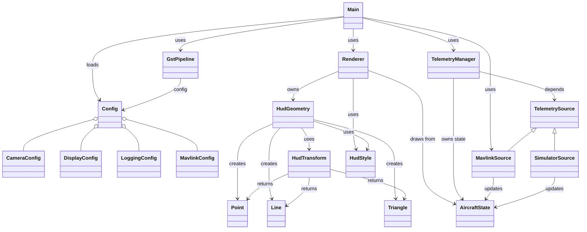

# HUD 2.0

## Purpose

The objective of HUD 2.0 is to create a flexible framework for generating a Heads-Up Display (HUD) on the aircraft that is overlaid onto the the current camera output, before transmitting to a ground station via a video streaming protocol. The advantage of this approach is that a fresh version of the HUD is generated for each frame delivered by the camera - i.e., the HUD always correlates with the camera view. Compared to the traditional approach of creating a HUD on a ground station the information is always 'fresh' and there is no possibility of drift between the video feed and telemetry feed.

The most obvious drawback is that the maximum latency needed to fly the aircraft using this approach is of the order of 200-250 milliseconds - beyond this the aircraft will feel 'sluggish' and unresponsive because of the gap between pilot input and changes on the display. This limitation is a significant requirement for the whole system - the target maximum latency is ~200 milliseconds. This is the total end-to-end latency target (including any latency in the transmission path).

## Scope

HUD 2.0 is a single Python3 package that has a number of external dependancies (which are installed via a setup.sh script). It is capable of direct interaction with a flight controller that generates MAVLink 2 messages, however is is normally connected to the flight controller via mavproxy.

The configuration of the flight controller and mavproxy are outside the project scope.

## Design Principles

HUD 2.0 makes full use of Python3 (version 3.13) to create a coherent model that follows classical Object Oriented Programming (OOP) principles. Classes have a single responsibility, ownership of data is strictly managed and types are enforced, the open-closed principle is widely implemented.

### Timing

Timing is critical to this application:

- A new frame arrives every ~33milliseconds (assuming a framerate of 30 fps)
- The maximum budget for drawing the HUD and placing the updated frame in the output is therefore ~30milliseconds
- Telemetry data arrives at a variable rate, this is asynchronous compared to the video data. The design should isolate the telemetry update rate from the video timing.

### Feature Set

The HUD output should be capable of expansion (adding new features) or minimisation (not displaying unwanted features). The minimum feature set consists of a horizon line (that should move in relation to current aircraft pitch and roll); a fixed representation of the aircraft (body and wings); an indication of heading, altitude (AGL) and airspeed. Building on top of this minimum feature set it is desirable to show graphically aircraft pitch (a pitch ladder) and aircraft roll (a roll scale) - both of these should be synchronised to the horizon line.

The design should be capable of expansion to further features, such as: RSSI, glide slope, GPS status, compass tape, graphical presentation of height and speed. Ideally, it should be possible for the pilot to change the HUD configuration via a YAML file, potentially whilst in flight.

Video processing (such as the use of hardware encoders) should be designed to allow multi-platform support.

## Current Implementation

The code is divided into several modules:

- main.py
  - orchestrates startup
  - creates `GstPipeline`, `Renderer`, `TelemetryManager`, `MavlinkSource`

- config.py
  - defines `Config` and nested config dataclasses

- gstpipeline.py
  - camera input + output pipeline
  - manages frames and GStreamer appsrc/appsink

- renderer.py
  - draws HUD overlays using `HudGeometry` and `HudStyle`

- telemetrymanager.py
  - owns aircraft state and refresh loop
  - delegates updates to `TelemetrySource`

- telemetrysource.py
  - abstract telemetry provider interface
  - implemented by mavlinksource.py and simulatorsource.py

- hudgeometry.py
  - generates HUD geometry data from aircraft attitude

- hudtransform.py
  - converts aircraft-space coordinates into screen-space

- hudtypes.py
  - basic primitive types: `Point`, `Line`, `Triangle`

This produces three main sub-systems:

- HUD Rendering
    The components required to define and draw the HUD on a frame-by-frame basis using the current telemetry information which is presented as aircraft state. The HUD is drawn at the same rate as the video framerate (e.g. 30fps), however the telemetry data arrives asynchronously and so the 'latest' information is used.

- Telemetry
    The components required to collect and update the aircraft state. It is an objective to support alternative Mavlink2 telemetry sources (pymavlink, MAVROS, etc.) so the details of the telemetry provider are abstracted away from a telemetry manager. The telemetry manager owns the aircraft state object which is shared with the HUD rendering sub-system and provides the interface between the two sub-systems. As a result of the asynchronous nature of the telemetry data stream the actual telemetry collection operates within its own thread. The abstraction of an aircraft state object allows data to be collected and consumed without a need to wait for a telemetry update.

- Video Pipelines
    Video pipelines are provided by a single class that creates separate Gstreamer input and output pipelines. There is not a direct connection between the pipelines and the HUD renderer; collection of a video frame, passing to the renderer, subsequent collection and transmission via the output pipeline is orchestrated by the main.py loop. The GstPipeline class handles all Gstreamer interaction, including error management and timing.

This class diagram shows the relationship between the components:

## Future Enhancements

1. Expand the model to allow the user (via config.yaml) to specify the platform in use
    - Allow platform-specific requirements to be managed in one place
    - Move the system from a Raspi-focused implementation to a more generic basis that supports other platforms (e.g. Jetson Nano)
    - Support a more varied list of cameras

2. Allow the use of alternative libraries for interaction with MAVLink. Currently the system is tied to pymavlink, but in the future MAVROS may be used.

3. Integrate the use of a simulated camera to support the use of HUD 2.0 as a training aid.

## Related Documents
